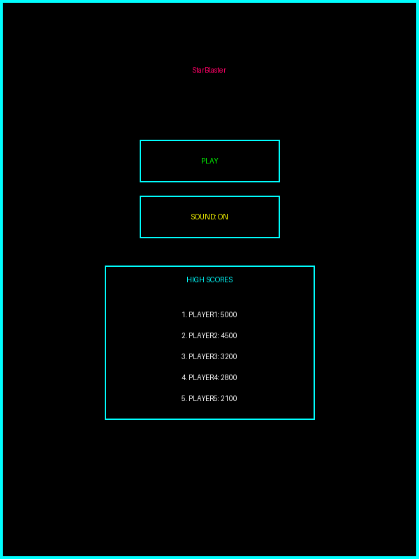
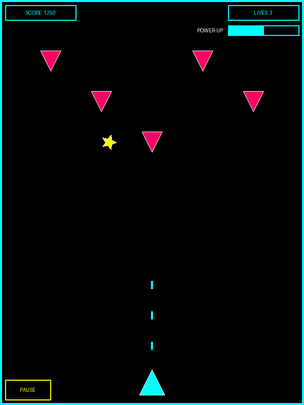
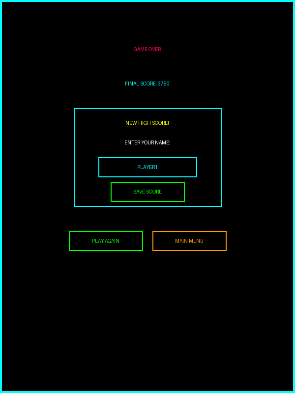

# StarBlaster

A retro-style space shooter game where you control a spaceship, shoot enemies, and collect power-ups to achieve the highest score possible.

## Game Features

### Start Screen

- Retro-styled title with "Press Start 2P" font
- Play button to start the game
- Sound toggle button (ON/OFF)
- High scores display showing top 5 scores

### Gameplay

- Control a spaceship at the bottom of the screen
- Dodge enemy ships coming from the top
- Shoot lasers to destroy enemies and earn points
- Lives counter showing remaining attempts
- Score display updating in real-time
- Pause functionality to temporarily stop the game

### Power-up System
- Star-shaped power-ups appear every 30 seconds
- Collecting a power-up grants double-shot ability for 5 seconds
- Visual indicator shows remaining power-up time
- Special sound effect plays when power-up is collected

### High Score System
- Scores are saved locally using browser's localStorage
- Top 5 high scores are displayed on the start screen
- New high scores can be submitted with a player name
- Scores are sorted in descending order

### Game Over Screen

- Displays final score achieved
- Option to submit score if it qualifies as a high score
- Play Again button to restart the game
- Main Menu button to return to the start screen

## Verification Checklist

Before deploying or sharing the game, verify that the following features are working correctly:

### Core Functionality
- [ ] Game starts when Play button is clicked
- [ ] Player ship moves left and right with arrow keys
- [ ] Spacebar fires lasers from the player ship
- [ ] Enemy ships appear from the top of the screen
- [ ] Collision detection works (player-enemy, bullet-enemy)
- [ ] Score increases when enemies are destroyed
- [ ] Lives decrease when player collides with enemies
- [ ] Game ends when player loses all lives

### Power-up System
- [ ] Power-up stars appear periodically (every 30 seconds)
- [ ] Collecting power-up enables double-shot ability
- [ ] Power-up timer displays remaining time
- [ ] Power-up expires after 5 seconds

### Sound System
- [ ] Laser sound plays when shooting
- [ ] Explosion sound plays when enemies are destroyed
- [ ] Power-up sound plays when collecting a power-up
- [ ] Game over sound plays when the game ends
- [ ] Sound toggle button correctly enables/disables all sounds

### High Score System
- [ ] High scores are displayed on the start screen
- [ ] New high scores can be submitted after game over
- [ ] High scores persist after page refresh (localStorage)
- [ ] Only top 5 scores are saved and displayed

### User Interface
- [ ] All screens (start, game, game over) display correctly
- [ ] Pause button works during gameplay
- [ ] Play Again button restarts the game
- [ ] Main Menu button returns to start screen
- [ ] Game is responsive and playable on different screen sizes

## Troubleshooting Tips

### Sound Issues
- If sounds don't play, check that your browser allows audio autoplay
- Verify that sound files exist in the assets/sounds directory
- Try toggling the sound button OFF and then ON again
- Check browser console for any errors related to audio loading

### Performance Issues
- If the game runs slowly, try closing other browser tabs and applications
- Ensure your browser is updated to the latest version
- Disable browser extensions that might interfere with canvas rendering
- For mobile devices, ensure you're not in battery saving mode

### Control Issues
- If keyboard controls don't work, click on the game area to ensure it has focus
- Check that no browser extensions are blocking keyboard input
- For mobile devices, ensure you're using a browser that supports touch events

### High Score Issues
- If high scores aren't saving, check that localStorage is enabled in your browser
- Clear browser cache if scores appear to be corrupted
- Private/incognito browsing modes may prevent localStorage from working

### Display Issues
- If the game appears too small or large, adjust browser zoom level
- Ensure the "Press Start 2P" font is loading correctly from Google Fonts
- Try refreshing the page if any UI elements appear misaligned

## Technologies Used

- HTML5 Canvas for rendering the game
- Vanilla JavaScript for game logic
- CSS3 for styling and animations
- Local Storage API for saving high scores
- Web Audio API for sound effects

## How to Play

### Controls

- **Left Arrow**: Move ship left
- **Right Arrow**: Move ship right
- **Spacebar**: Shoot lasers
- **P or Pause Button**: Pause/resume game

### Gameplay

1. Avoid enemy ships - colliding with them ends the game
2. Shoot enemies to earn points
3. Collect power-up stars for temporary double-shot ability
4. Try to achieve the highest score possible

## Installation and Running Locally

### Prerequisites

- A modern web browser (Chrome, Firefox, Safari, Edge)
- Basic knowledge of running a local server (optional)

### Method 1: Direct File Opening

1. Clone or download this repository:
   ```
   git clone https://github.com/gamebonker/starblaster.git
   ```
   
2. Navigate to the project directory:
   ```
   cd starblaster
   ```
   
3. Open `index.html` in your web browser

### Method 2: Using a Local Server (Recommended)

1. Clone or download this repository:
   ```
   git clone https://github.com/gamebonker/starblaster.git
   ```
   
2. Navigate to the project directory:
   ```
   cd starblaster
   ```
   
3. Start a local server:

   **Using Python:**
   ```
   # Python 3
   python -m http.server
   
   # Python 2
   python -m SimpleHTTPServer
   ```
   
   **Using Node.js:**
   ```
   # Install http-server if you haven't already
   npm install -g http-server
   
   # Start the server
   http-server
   ```
   
4. Open your browser and navigate to:
   ```
   http://localhost:8000
   ```

## Deployment Instructions

### GitHub Pages Deployment

1. Create a GitHub repository for your game

2. Push your code to the repository:
   ```
   git init
   git add .
   git commit -m "Initial commit"
   git branch -M main
   git remote add origin https://github.com/gamebonker/starblaster.git
   git push -u origin main
   ```

3. Go to your repository on GitHub

4. Navigate to Settings > Pages

5. Under "Source", select "main" branch and the root directory

6. Click "Save"

7. Your game will be available at `https://gamebonker.github.io/starblaster/`

### Netlify Deployment

1. Create a Netlify account at [netlify.com](https://www.netlify.com/)

2. Choose one of these deployment methods:

   **Method 1: Drag and Drop**
   - Go to the Netlify dashboard
   - Drag and drop your project folder onto the designated area
   
   **Method 2: Connect to GitHub**
   - Click "New site from Git"
   - Select GitHub and authorize Netlify
   - Choose your repository
   - Configure build settings (not needed for this project)
   - Click "Deploy site"

3. Once deployed, Netlify will provide you with a URL like `https://your-site-name.netlify.app`

4. You can customize the URL in the site settings

### Vercel Deployment

1. Create a Vercel account at [vercel.com](https://vercel.com/)

2. Install the Vercel CLI:
   ```
   npm install -g vercel
   ```

3. Navigate to your project directory and run:
   ```
   vercel login
   vercel
   ```

4. Follow the prompts to complete the deployment

5. Your game will be available at the provided Vercel URL

## Development Notes

### File Structure

```
starblaster/
├── index.html          # Main HTML file
├── style.css           # CSS styling
├── game.js             # Game logic
├── assets/             # Game assets
│   ├── images/         # Image files
│   │   ├── start_screen.png
│   │   ├── gameplay_screen.png
│   │   └── game_over_screen.png
│   └── sounds/         # Sound files
│       ├── explosion.wav
│       ├── gameover.wav
│       ├── laser.wav
│       └── powerup.wav
├── .gitignore          # Git ignore file
└── README.md           # This file
```

### Potential Improvements

- Add multiple levels with increasing difficulty
- Implement different enemy types
- Add boss battles
- Include more power-up varieties
- Add background music
- Create a mobile-optimized control scheme with touch controls
- Implement online leaderboards


## License

This project is licensed under the MIT License - see the LICENSE file for details.
